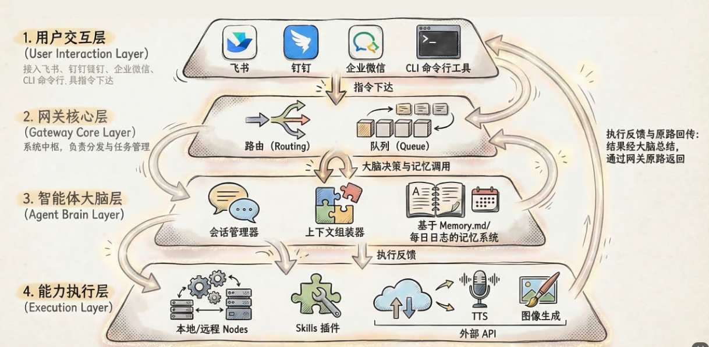

# OpenClaw 企业应用手册

> 以**企业应用**为视角：在企业内通过飞书接入 OpenClaw，实现访问控制、多团队、安全合规与运维的一体化说明。

## OpenClaw 架构图：从指令交互到能力执行

OpenClaw是一个开源的本地AI智能体框架，通过讲LLM（大脑）与多种执行工具结合，实现自动化任务处理，本架构展示了从用户输入到系统决策，再到最终执行和反馈的技术路径。

---

## 1️⃣ 企业应用 — 文档导航

| 章节      | 文档                                        | 说明                                        |
| ------- | ----------------------------------------- | ----------------------------------------- |
| **总览**  | [企业应用概述与考虑角度](./01-企业应用概述与考虑角度.md)        | 企业应用是什么、落地需考虑的 10 个角度、手册结构                |
| **部署**  | [安装与运行](./02-安装与运行.md)                    | 环境、安装、网关、日常使用与命令速查                        |
| **部署**  | [Dashboard 使用说明](./02-1-Dashboard使用说明.md) | 为何需要、如何访问、面板功能（Chat/Config/Skills/Cron 等） |
| **飞书侧** | [飞书应用创建与发布](./03-飞书应用创建与发布.md)            | 企业自建应用、权限、事件订阅、发布与生命周期                    |
| **配置**  | [通道配置与访问控制](./04-通道配置与访问控制.md)            | OpenClaw 配置飞书、私聊/群聊策略、允许列表（企业推荐）          |
| **多团队** | [多团队与多 Agent](./05-多团队与多Agent.md)         | 按部门/群路由到不同 Agent、bindings 配置              |
| **安全**  | [安全与合规](./06-安全与合规.md)                    | 凭证保护、访问控制、审计、合规与数据隐私                      |
| **能力**  | [飞书企业应用场景](./07-飞书企业应用场景.md)              | 飞书相关 Skills 与官方能力场景                       |
| **能力**  | [常用 Skills 使用说明](./skills/index.md)       | 各技能分篇：用途、安装、配置、怎么用                        |
| **运维**  | [运维与故障排查](./08-运维与故障排查.md)                | 日志、监控、备份、常见问题与应急                          |
| **参考**  | [配置参考](./10-配置参考.md)                      | 飞书通道配置项与 dmPolicy 速查                      |

---

## 快速开始（企业场景 3 步）

1. **安装并启动网关**：`npm install -g openclaw@latest` → `openclaw onboard --install-daemon`
2. **创建飞书企业自建应用**：在 [飞书开放平台](https://open.feishu.cn/app) 创建应用，配置权限与事件订阅（长连接），发布到企业
3. **在 OpenClaw 中配置飞书并做访问控制**：`openclaw channels add` 填写 App ID/Secret，在配置中设置 `dmPolicy: "allowlist"` 与 `allowFrom`（仅内部员工）

详细步骤见各章节。

---

## 相关链接

- [OpenClaw 官方文档](https://docs.openclaw.ai)
- [飞书通道英文原文](https://docs.openclaw.ai/channels/feishu)
- [飞书开放平台](https://open.feishu.cn/app)（国内）/ [Lark](https://open.larksuite.com/app)（国际）
